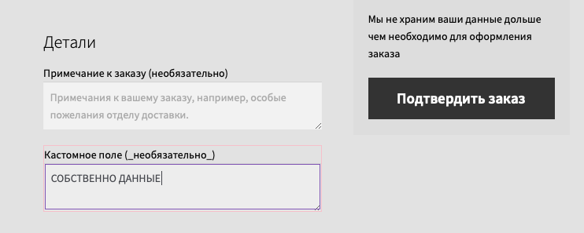
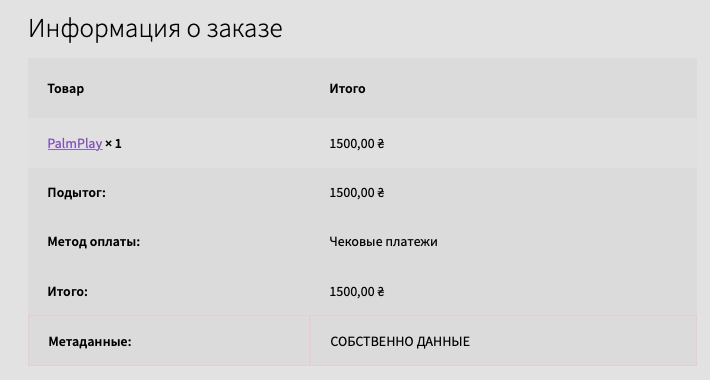
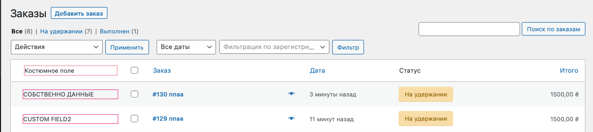
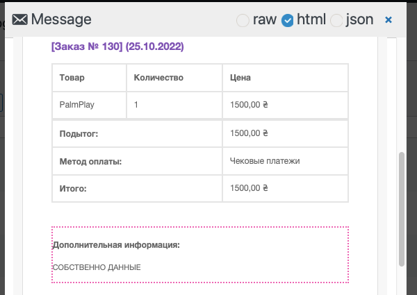

### Плагин добавления кастомного поля к чекауту V1.0

#### Задача:
Создать плагин, который:
1. Будет добавлять новое поле в чекаут WooCommerce, например «Дополнительная информация»
2. Пользователь может ввести дополнительную информацию во время чекаута, эта информация должна показываться на всех страницах чекаута, быть в письме, которое отправляется на почту после совершения покупки и отображаться в ордере в админке.

### Результат:

#### Страница оформления заказа:
- имеет дополнительное заполняемое юзером поле:  
 

#### Страница "Заказ принят"
- тоже относится к чекауту, потому на неё выводится уже сохранённые данные из поля:  
 
- если кастомное поле не было заполнено, то строка к таблице не добавляется вообще

#### Страница заказов в админке
- имеет колонку с содержимым кастомных полей:  
 

#### Сообщение для пользователя
- на имеил юзера отсылается сообщения с информацией из кастомного поля:  
 